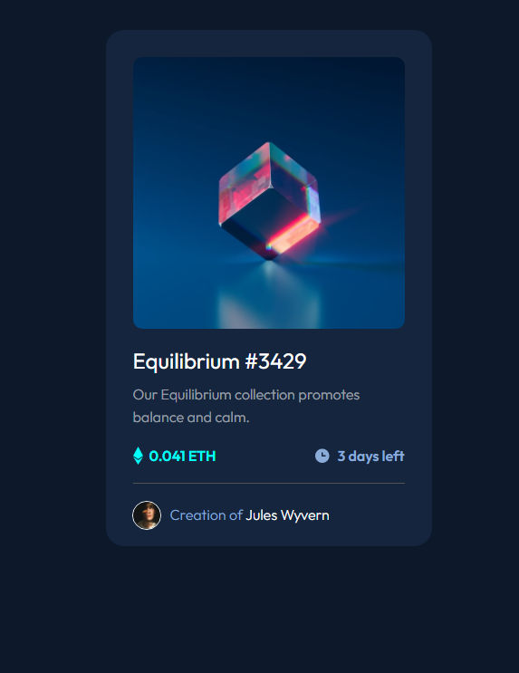

# NFT preview card component - Frontend Mentor

This is a solution to the [NFT preview card component challenge on Frontend Mentor](https://www.frontendmentor.io/challenges/nft-preview-card-component-SbdUL_w0U).

## Table of contents

- [Overview](#overview)
  - [Screenshot](#screenshot)
  - [Links](#links)

## Overview

### The challenge

Users should be able to:

- View the optimal layout depending on their device's screen size
- See hover states for interactive elements

### Screenshot

  

### Links

- Solution URL: [github](https://vaaakoo.github.io/Nft-card-Tailwindcss/)
- Live Site URL: [live site](#)

- [Tailwindcss](https://tailwindcss.com/docs/installation) - CSS framework

## **Have fun building!** 🚀
